# Collaboration Network Analysis, Phase 2: Results Summary

Jacob Chen, Adrian Rodriguez Vazquez, Madison Seal, Sahaj Baxi

## Network Overview

Our constructed graph is composed of 13,903 authors, 7,553 publications, 28,300 authorship edges, and 113,178 coauthorship edges spanning ICSE, ICSA, and ECSA from 2016 to 2025.

## Major Findings

### Conference Trends

- ICSE was the largest conference, peaking at ~2,400 authors and ~850 publications in 2018. General downward trends in authors and publications are observed in both ICSE and ECSA.
- ICSA follows a consistent upward curve from 2018 onwards. Years 2016 and 2017 are left at zero for ICSA due to lack of data.
- Both ICSE and ICSA experienced a dip in authorship and publications in 2021.

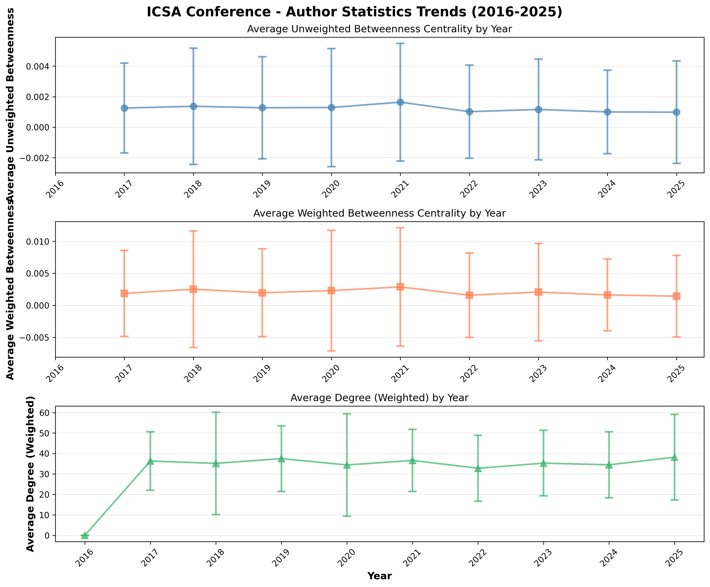
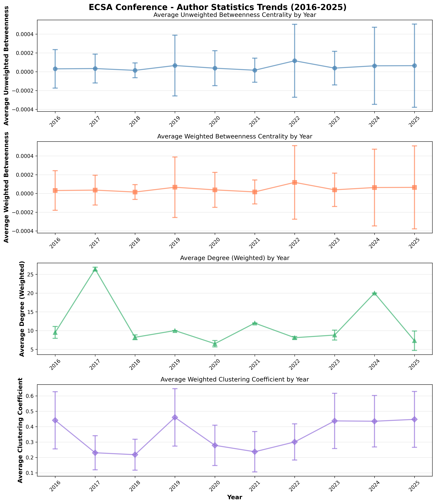
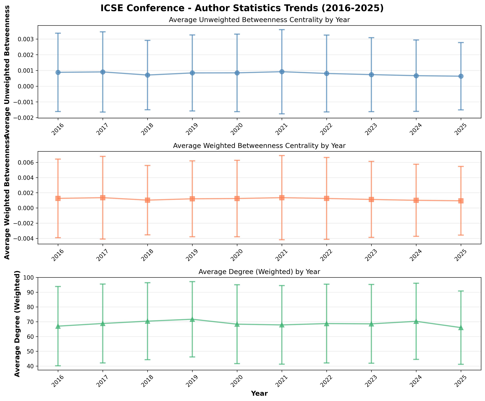

### Author Centrality Metrics

- ICSA author betweenness centrality remained near zero across all years, with a slight increase in 2021. Average degree remained at ~4, while clustering coefficient fluctuated around ~0.35.
- ICSE author betweenness centrality similarly remained near zero. Average degree centrality follows a slight upward trend, while clustering coefficient dips from 2022 to 2023.
- ECSA author betweenness centrality experienced slight increases in 2018 and 2022. Average degree centrality peaks at ~6 in 2017 and ~5 in 2024, remaining at ~4.5 for other years. Weighted clustering coefficient peaks in 2016 and 2019 before plateauing at ~0.45.

### Degree Distribution and Network Structure

- **The degree distribution is log-normal, not scale-free.** A power-law fit yields alpha = 2.70, but the log-likelihood ratio test strongly favors log-normal (R = -23.25, p < 0.0001). This suggests growth through a combination of preferential attachment and bounded group sizes.
- **The network is strongly small-world** (sigma = 836.7). Authors are embedded in extremely dense local cliques (C = 0.806, ~1,086x the random baseline) yet are globally reachable within ~6 hops on average.
- The giant component contains 10,307 authors (74.1%). The remaining 1,119 components are small isolated groups.

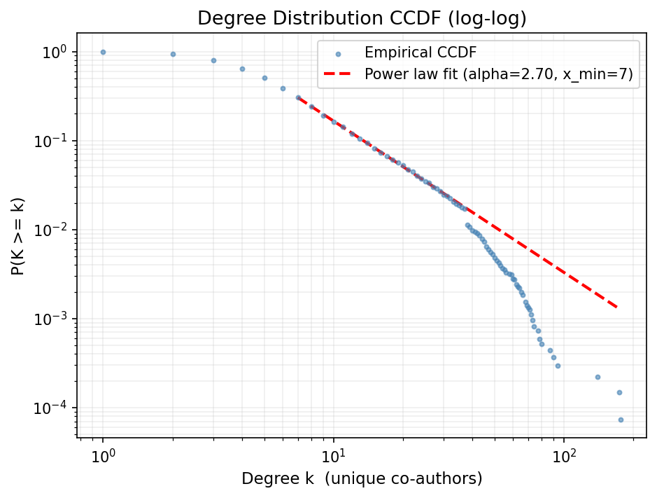

### Author Roles and Centrality

- **Weighted degree** is highly skewed: mean = 6.5, median = 4.0, max = 140, David Lo (note: previously reported as Yan Liu 176 due to a disambiguation error that combined two authors and overreported a degree). The vast majority of authors have degree <= 10; a small elite exceeds 50.
- **Betweenness**: mean = 0.00019, median = 0.0. The top betweenness authors are not identical to the top degree authors — Rick Kazman (degree 71) ranks 3rd in betweenness ahead of authors with far higher degree, confirming that structural bridging and collaboration volume are distinct roles.
- **Clustering**: mean = 0.784, median = 1.0. More than half of all authors are in perfectly closed triangles.

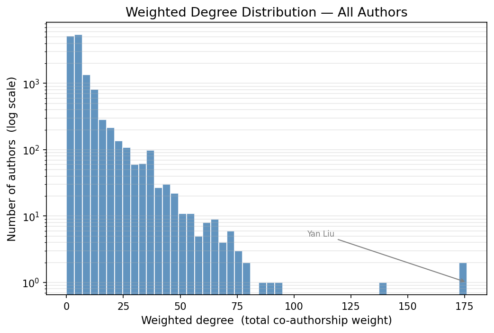

- Three structural roles emerge: **core** (61.9%), **broker** (25.0%), and **peripheral** (13.1%). Hub and embedded roles are absent because the degree and clustering distributions do not simultaneously produce authors meeting both thresholds at the 75th/25th percentile cutoffs.
- Brokers have higher median degree (8 vs. 5 for core) but lower clustering (0.23 vs. 1.0), confirming they bridge weakly connected neighborhoods.

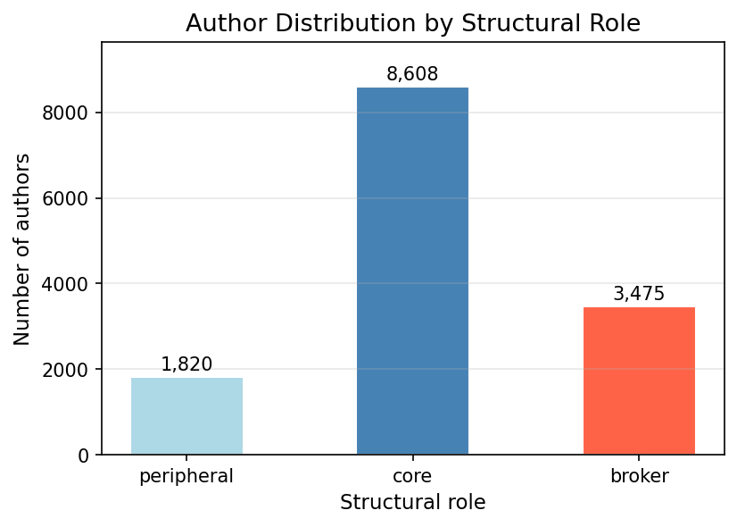
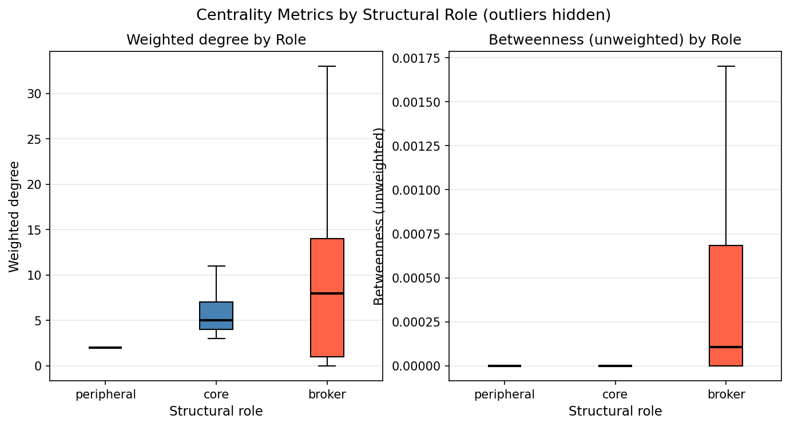

### Community Structure

- **1,176 communities** detected by Louvain. Size distribution is extremely skewed: median = 3, mean = 11.8, max = 632.
- 29.9% of communities are singletons. The top 5 communities contain 17.2% of all authors (2,396), and the top 10 contain 29.7% (4,132).
- The log-log histogram shows a roughly power-law community-size distribution.

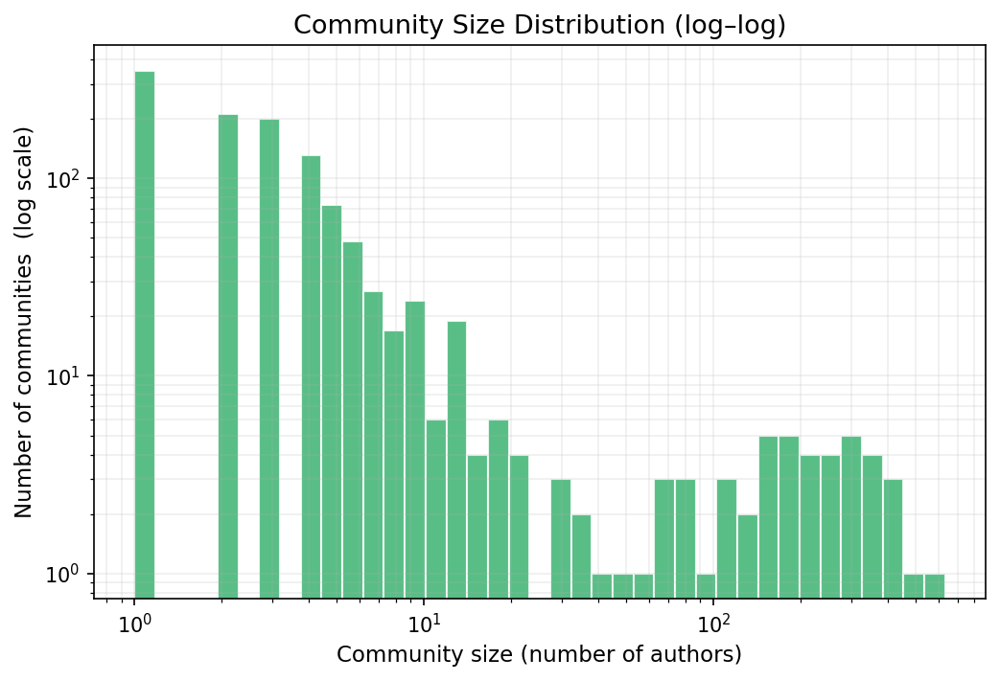

### Bridge Authors

- **844 bridge authors** (6.1% of the network) publish across multiple conferences: 632 span 2 conferences, 212 span all 3.
- ICSA-ICSE bridges (245) outnumber ECSA-ICSE bridges (206), consistent with ICSA's closer relationship to mainstream SE research.
- Top bridges by publications: Patricia Lago (48), Rick Kazman (41), Patrizio Pelliccione (37). Top by betweenness: David Lo 0001, 0.035 (previously Yan Liu at 0.037 due to disambiguation error) — both 2-conference bridges whose structural importance comes from bottleneck positioning between ICSA and ICSE.

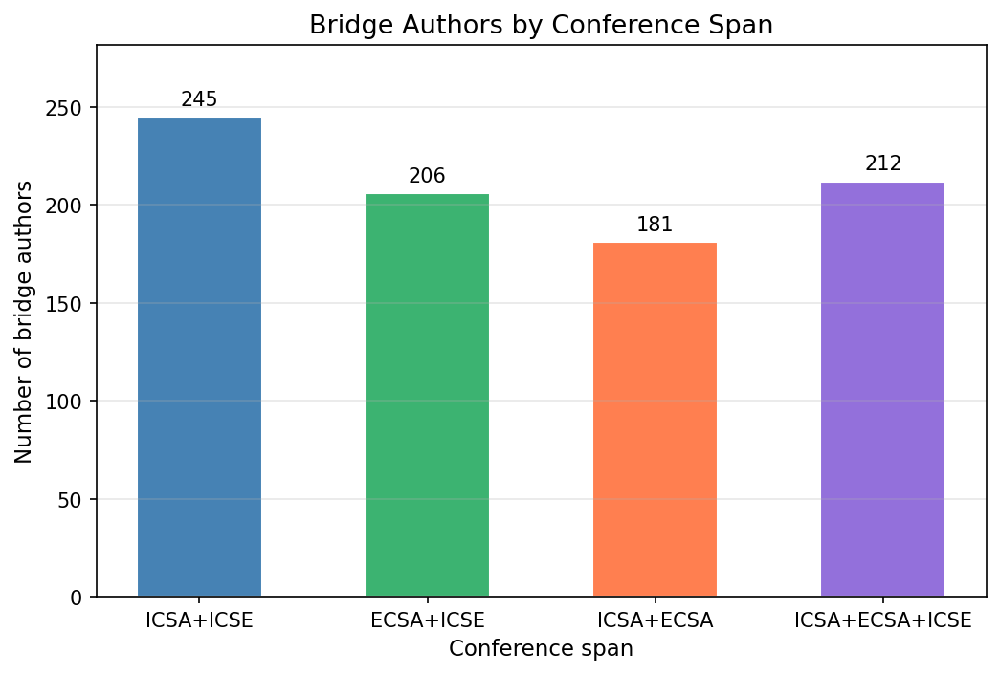
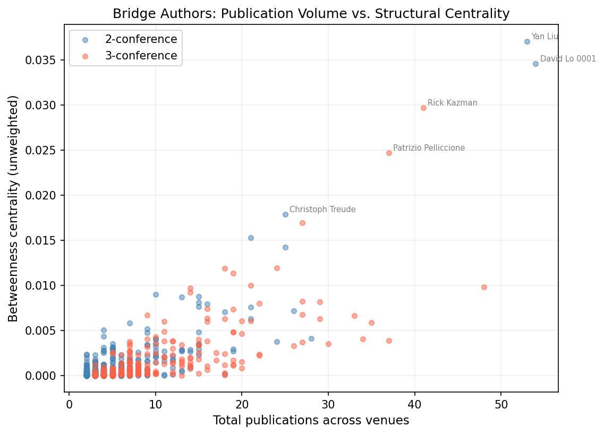

### K-Shell Decomposition

- Max k-shell: k = 37. The k-37 nucleus contains 76 authors, all with >= 37 mutual co-authorship connections within the core.
- Top k-37 authors by betweenness include Neha Rungta, Emina Torlak, Peng Di, and Zhaogui Xu — predominantly software analysis/verification researchers, suggesting the densest nucleus is anchored by a formal-methods sub-community.

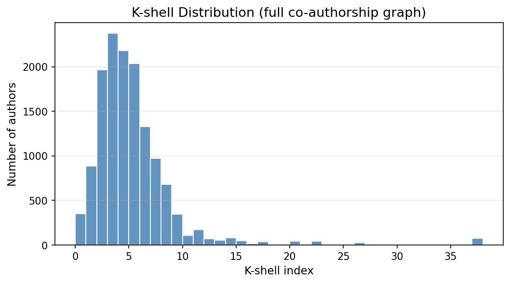
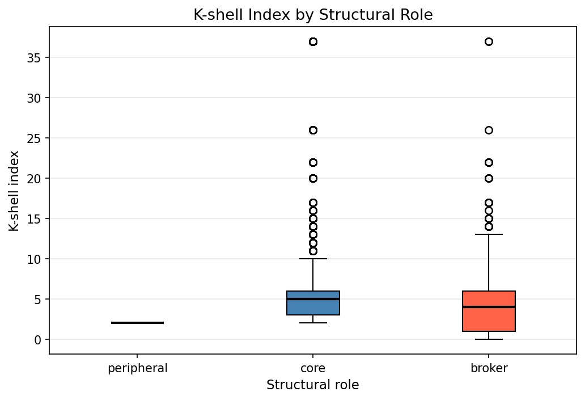

## Statistical Analyses

### Weighted Degree Centrality

- **Significant difference** between ICSE and both ECSA and ICSA (Friedman p = 0.0021, Kruskal-Wallis p = 0.00083; effect sizes 0.3-0.7). No significant difference between ECSA and ICSA.
- ICSE follows a **significant upward trend** in weighted degree (Mann-Kendall p < 0.001, Sen's slope = 0.248/yr). No significant trends for ICSA or ECSA.

### Weighted Betweenness Centrality

- **No significant difference** across conferences (Friedman p = 0.459).
- **No significant trends** over time for any conference.

### Weighted Clustering Coefficient

- **Significant difference** between ICSE and both ECSA and ICSA (Friedman p = 0.0043; effect sizes 0.45-0.61). No significant difference between ECSA and ICSA.
- **No significant trends** over time for any conference.

## Additional Charts

| Chart | Description |
|-------|-------------|
| [Assortativity Trends](../analysis/plots/task7_assortativity_trends.png) | Degree assortativity by conference and year |
| [Role Transitions](../analysis/plots/task8_transition_heatmap.png) | Role transition probability heatmap across consecutive years |
| [Role Proportions](../analysis/plots/task8_role_proportions.png) | Role composition per conference over time |
| [Community Persistence](../analysis/plots/task9_community_persistence.png) | Year-over-year community stability (Jaccard similarity) |
| [Cross-Pollination](../analysis/plots/task10_cross_pollination.png) | Fraction of ICSA/ECSA authors also publishing at ICSE |
| [Author Retention](../analysis/plots/task12_retention_curves.png) | Retention curves by conference across debut cohorts |
